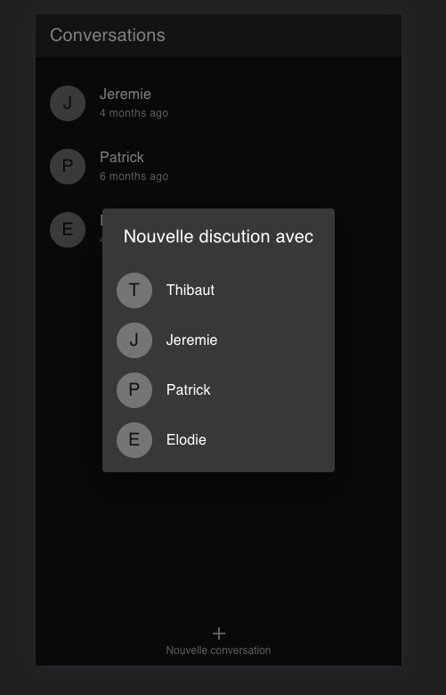
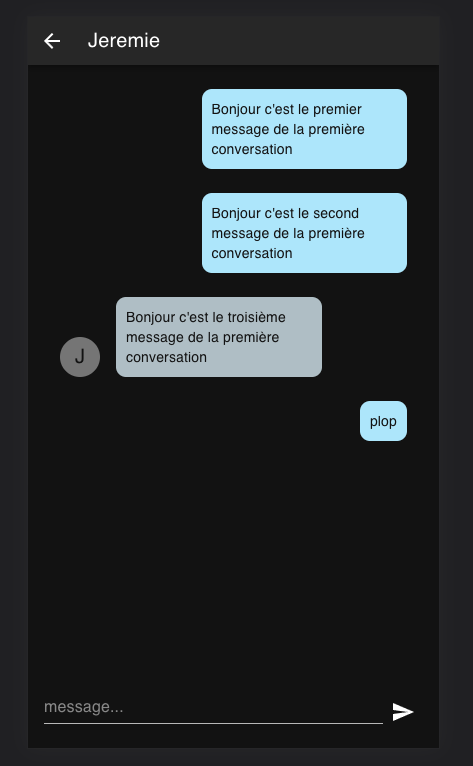

# Conversation App

## Features

- List conversations
- Add message to conversation
- Add new conversation

## Technical choices

I choose MUI to make a clean responsive interface. MUI has all components we need to make app prototyping clean and fast and it's fully customizable via styled components.

## Time spend

approximately 8 hours

## Issues

- I had to fix the middlware because it did not fetch fresh data after a discution was added
- The delete API doesn't seems to work
